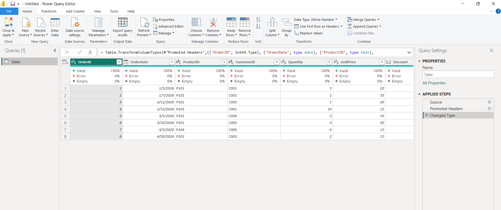

# Day 1 – Connecting & Promoting Headers

**Task:** Load `Sales.csv` and ensure proper column headers.

**What I did:**

- Used Get Data → Text/CSV → **Transform Data** (not Load).
- Observed that Power Query automatically promoted the first row, creating the step `= Table.PromoteHeaders(#"Changed Type")`.
- Also tested manual promotion via UI: Home → Use First Row as Headers.

**Key Learnings:**

- Skipping promotion leaves columns as `Column1`, `Column2`, breaking later logic.
- The M function `Table.PromoteHeaders` is simple; the advanced option `[PromoteAllScalars=true]` exists but is rarely needed.
- Always check the **Applied Steps** pane to verify automatic operations.

---

## 🧠 Deep Dive: Understanding Auto-Detection (The "Changed Type" Step)

In Power Query, the very first step you usually see after connecting to a data source is **"Changed Type"**.
Behind the scenes, Power Query uses a feature called **Auto-Detection** to guess the data type (Text, Number, Date, etc.) for every column.

But is this helpful intern always right? **Absolutely not.**

Here is everything you need to know about when to trust it, when to disable it, and what happens under the hood.

---

### ❌ Part 1: Why You Should Disable Auto-Detection (The Risks)

Auto-detection is convenient for beginners, but it is a **silent killer** in production environments. Here is why the top 0.1% of Power BI developers turn it off immediately:

| Risk                                  | Explanation                                                                                                                                                                                                                                                                                              |
| :------------------------------------ | :------------------------------------------------------------------------------------------------------------------------------------------------------------------------------------------------------------------------------------------------------------------------------------------------------- |
| **🔴 The "Row 201" Betrayal**         | Auto-detection scans only the **first 200 rows** by default. If row 201 has a decimal in a column that previously only had whole numbers, the refresh will fail, or worse—turn that cell into an `Error` without warning.                                                                                |
| **🐌 Performance Overhead**           | Scanning every cell in the first 200 rows of _every single column_ takes time. For large datasets with many tables, this wasted scanning adds unnecessary seconds (or minutes) to every single refresh.                                                                                                  |
| **💥 Silent Schema Drift**            | If your source file suddenly gets a new column or a column changes its format (e.g., an ID turns into Text), auto-detection might "fix" it quietly. However, your downstream DAX measures or reports that depend on the _old_ type will break mysteriously with zero clear error messages.               |
| **🧩 Incremental Refresh Nightmares** | If you use incremental refresh, Power Query scans _each partition_ separately. If Partition 1 has Integers and Partition 2 has Decimals (due to source drift), auto-detection creates inconsistent column types across partitions. This causes refresh failures that are an absolute nightmare to debug. |
| **☁️ Connector Overrides**            | Some advanced connectors (like Snowflake or Google BigQuery) bring their own strict native types. Auto-detection sometimes overrides these correct types with wrong guesses, especially regarding decimal precision or timezone-aware datetimes.                                                         |

---

### ✅ Part 2: When Is It Okay to Keep Auto-Detection On?

Auto-detection isn't always the villain. You can safely keep it on in these specific scenarios:

1. **🧪 Ad-hoc Analysis / Prototyping**: You are just exploring the data and will never refresh this report again. Development speed > optimization.
2. **🏢 Stable, Internal Data Warehouses**: If your source is a strictly governed SQL database with enforced schemas that _never_ change, the auto-detection guesses will likely be 100% correct.
3. **🔍 Exploratory Phase**: You want to take a quick peek at what columns exist and their approximate shape before writing your actual, permanent transformation logic.

---

### ⚙️ Part 3: Behind the Scenes (What "Changed Type" Actually Does)

When you click "Detect Data Type" or let Power Query auto-generate the `Changed Type` step, here is the exact process happening in the engine:

1. **Scan:** Power Query looks at the **first 200 rows** of your data source (this limit is configurable in the options).
2. **Majority Vote:** It analyzes the values in those 200 rows and picks the most frequently occurring data type (e.g., if 199 rows are numbers and 1 is text, it picks `Int64.Type`).
3. **The Code Generation:** It writes a line of M code wrapping every column in `Table.TransformColumnTypes` with its "best" guess.
4. **The Silent Killer (Row 201):** If row 201 contains a different type, Power Query does **not** throw an error during the preview. It loads the data, but turns the offending cell into a `null` or an `Error`. Your report looks fine in Desktop, but breaks in the Power BI Service after a scheduled 3 AM refresh with a vague, cryptic error.

---

### 🏆 Part 4: The Golden Rule (The 0.1% Professional Standard)

> **"Always disable auto-detection for production models."**

1. **Be Explicit:** Manually write the types for every single column using `Table.TransformColumnTypes`.
2. **Handle the Mess:** If a column can potentially contain mixed types (e.g., numbers and text), import it as `type text` first, clean the data, and _then_ convert it to a number.
3. **Fail Loudly:** Explicit transformations fail with clear, pinpointed error messages at the exact step they break. This makes debugging 10x faster.

---

> [!TIP]
> **`Table.TransformColumnTypes` vs `Table.TransformColumns`**  
> `Table.TransformColumns` is a general-purpose transformer. `Table.TransformColumnTypes` is specialized purely for type changes. For a 100-million-row table, the specialized function is marginally faster because Power Query can optimize type casting differently. The difference is tiny, but in enterprise environments with hundreds of queries, it adds up.
>
> **Best Practice:** Use `Table.TransformColumnTypes` for pure type changes, and `Table.TransformColumns` only when you're doing something extra (like `each _ * 1000`) combined with a type change.

---

#### How to Write It Explicitly in M Code

Instead of relying on the UI's guesswork, write your own robust code:

```powerquery
let
    Source = Csv.Document(...),
    // Promote headers first
    #"Promoted Headers" = Table.PromoteHeaders(Source, [PromoteAllScalars=true]),
    // Explicitly type EVERY column
    #"Set Explicit Types" = Table.TransformColumnTypes(
        #"Promoted Headers",
        {
            {"OrderID", Int64.Type},      // Strict whole number
            {"OrderDate", type date},      // Strict Date
            {"ProductID", type text},      // Strict Text
            {"CustomerID", type text},     // Strict Text
            {"Quantity", Int64.Type},      // Strict whole number
            {"UnitPrice", Int64.Type},     // Strict whole number (or Currency.Type)
            {"Discount", type number}      // Strict decimal number
        }
    )
in
    #"Set Explicit Types"
```

**Screenshot:**

